# roc-graph-layout

A Roc package for deterministic, renderer-independent graph layout. It returns
node positions, edge routes, and drawing bounds without choosing how they are
rendered. Positions are node centers; routes are straight lines, polylines, or
chains of smooth cubic curves, and their endpoints attach to node box
boundaries so arrowheads land on the box.

**[Try the layouts in the browser](https://lukewilliamboswell.github.io/roc-graph-layout/)**
— edit the graph data and settings, inspect the generated SVG and geometry, or
browse the [versioned API documentation](https://lukewilliamboswell.github.io/roc-graph-layout/docs/).

The supported end-to-end layouts:

- `Layered` — directed flows such as dependencies, pipelines, and process
  diagrams, with orientation-preserving cycle handling, exact layer
  assignment, and balanced coordinates; `Layered.layout_exact` swaps the
  crossing-reduction heuristic for an effort-capped exact search that reports
  whether optimality was proven.
- `Tree` — input that is already a hierarchy, drawn level by level
  (`Tree.layout`) or radially with the root at the center
  (`Tree.layout_radial`).
- `Graph` — any sized graph: `layout_circular` (a ring, neighbors seated
  together), `layout_force` (organic clusters from a seeded simulation), and
  `layout_stress` (drawn distances track graph distances). The `ForceLayout`
  and `StressLayout` modules add reusable preparation, position hints, and
  pinned nodes; `RadialLayout` draws concentric rings by depth from a root.
- `Constrained` — stress layout subject to domain rules: minimum separation
  along an axis, alignment, and containment bands.
- `Compound` — nested layout groups whose completed child boxes are arranged
  by their parent, with straight or orthogonal routes across group boundaries.

Placement-independent passes compose with any layout: `Pack` (shelf packing
for forests and disconnected components), `Overlap` (minimal-movement overlap
removal), and `Metrics` (crossings, bends, stress, separation violations, and
displacement, for comparing layouts by measurement).

`Route.layout` adds deterministic orthogonal routes to any already-positioned
graph. It searches rectilinear corridors around sized nodes and unrelated
groups, accepts sparse automatic, side-only, or fixed endpoint attachments,
places size-only edge labels, and reports the selected attachments and group
boundary crossings in source order. Layered and Compound use this router by
default.

## Example

```roc
nodes = [
    { width: 90, height: 40 },
    { width: 90, height: 40 },
]
edges = [{ from: 0, to: 1 }]

input = { ..Layered.default_input, graph: { nodes, edges } }
settings = { ..Layered.default_settings, node_gap: 24, layer_gap: 70 }

result = Layered.layout(input, settings, Layered.default_run)?

# result.layout.positions lines up with nodes
# result.layout.routes lines up with edges
# result.layout.bounds encloses the drawing
```

## Example gallery

Click a layout to open the example app that generated it.

| Examples | Examples |
| --- | --- |
| [Build pipeline](examples/build_pipeline/main.roc) — layered<br>[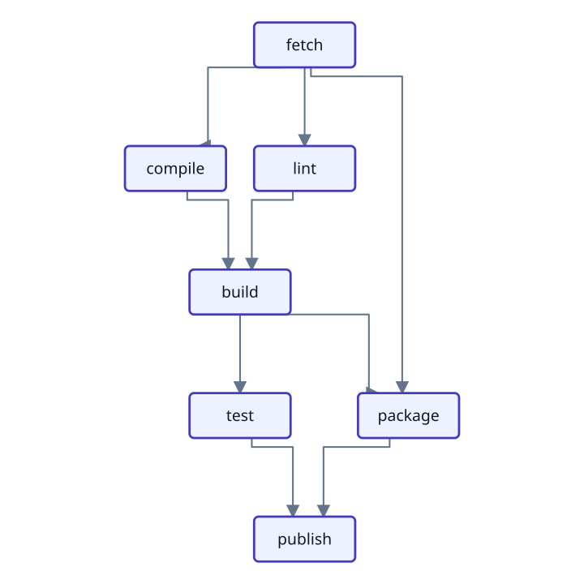](examples/build_pipeline/main.roc) | [Organization chart](examples/org_chart/main.roc) — tree<br>[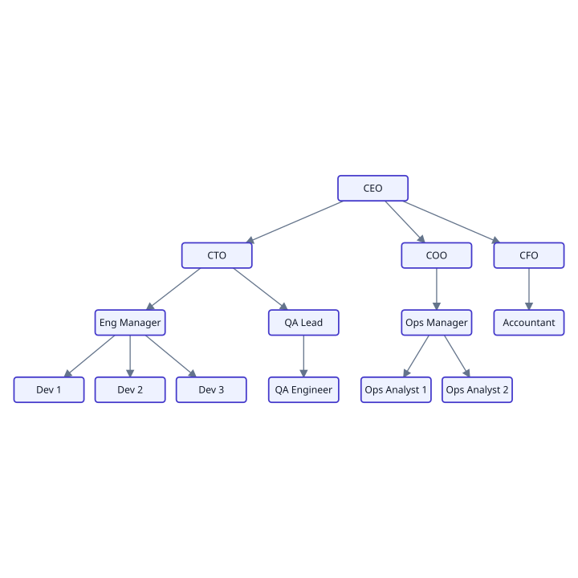](examples/org_chart/main.roc) |
| [Service ring](examples/service_ring/main.roc) — circular<br>[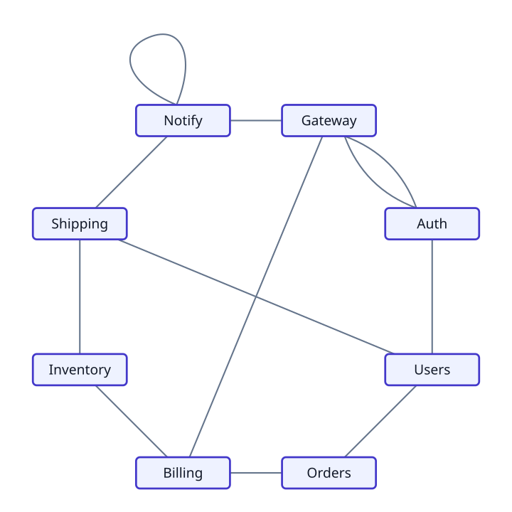](examples/service_ring/main.roc) | [Mind map](examples/mind_map/main.roc) — radial tree<br>[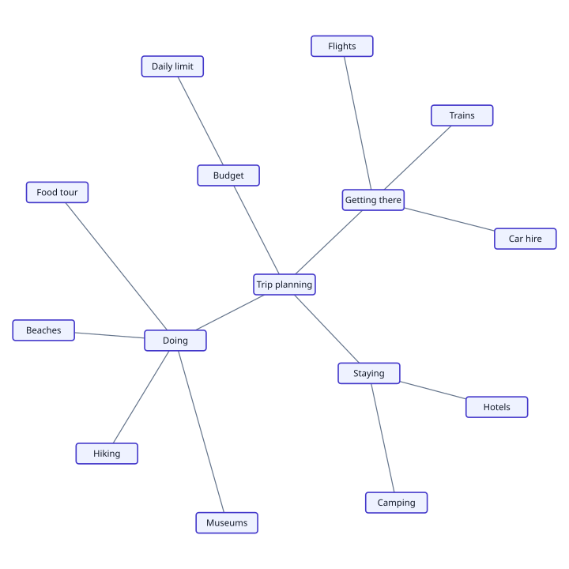](examples/mind_map/main.roc) |
| [Collaboration network](examples/collab_network/main.roc) — force-directed<br>[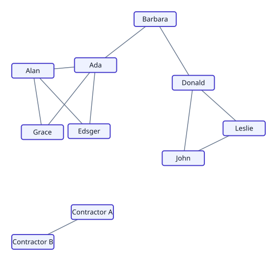](examples/collab_network/main.roc) | [Incident blast radius](examples/incident_blast_radius/main.roc) — radial graph<br>[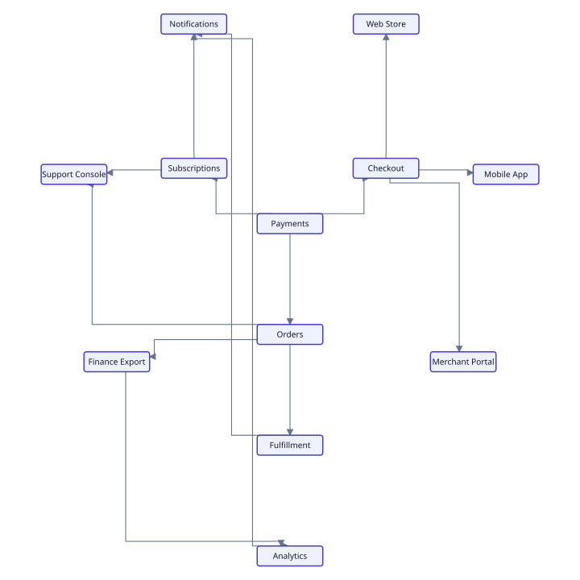](examples/incident_blast_radius/main.roc) |
| [Cloud deployment](examples/cloud_deployment/main.roc) — compound<br>[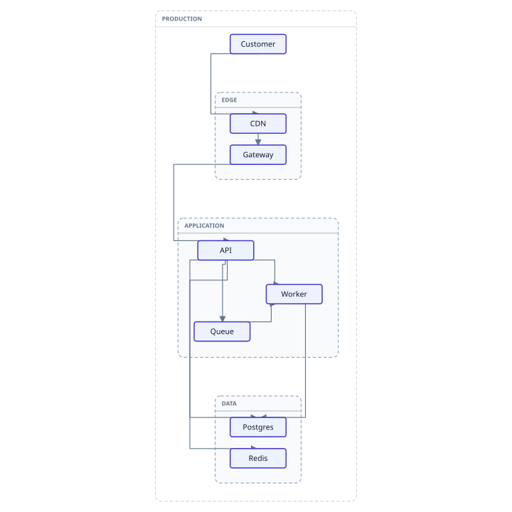](examples/cloud_deployment/main.roc) | [Release workflow](examples/release_workflow/main.roc) — constrained<br>[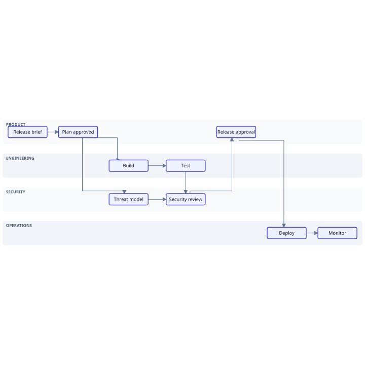](examples/release_workflow/main.roc) |
| [Transit network](examples/transit_network/main.roc) — stress<br>[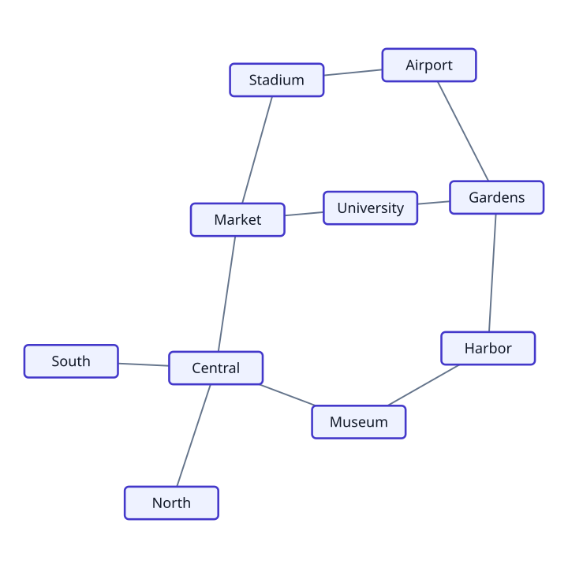](examples/transit_network/main.roc) | |
| [UML component diagram](examples/uml_component/main.roc) — compound<br>[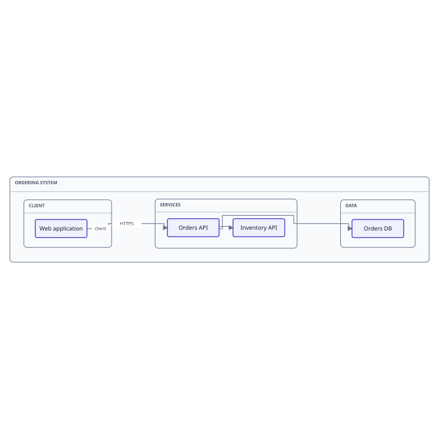](examples/uml_component/main.roc) | [UML class diagram](examples/uml_class/main.roc) — layered and routed<br>[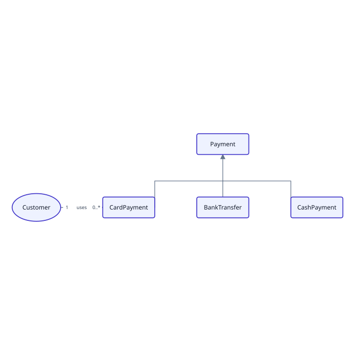](examples/uml_class/main.roc) |

See the [build-pipeline example](examples/build_pipeline/main.roc) for a
complete program that writes the result as SVG, the
[org-chart example](examples/org_chart/main.roc) for a level-by-level tree,
the [mind-map example](examples/mind_map/main.roc) for a radial tree, the
[service-ring example](examples/service_ring/main.roc) for a circular graph,
and the [collab-network example](examples/collab_network/main.roc) for a
force-directed graph with a disconnected component. The
[incident blast-radius example](examples/incident_blast_radius/main.roc) uses
concentric dependency hops, the
[cloud-deployment example](examples/cloud_deployment/main.roc) composes nested
infrastructure groups, and the
[release-workflow example](examples/release_workflow/main.roc) keeps work in
domain-specific responsibility lanes. The
[transit-network example](examples/transit_network/main.roc) shares its plain
graph fixture with the browser playground and uses stress layout so drawn
distance reflects network distance.

For repeated layouts of the same input and settings, use `Layered.prepare` once
and pass the result to `Layered.layout_prepared` with `Layered.default_run`.
Changed input must be prepared again.

## Development

Run the project checks with:

```sh
./scripts/check.roc
./scripts/test.roc
./scripts/bundle.roc [DIR]   # default DIR is dist
./scripts/all.roc            # check, test, then bundle
```

QA the browser playground from its vendored release assets with:

```sh
python3 scripts/serve.py
# open http://127.0.0.1:8000/
```

Pass `--port 8080` (or another port) if 8000 is already in use. This serves
the checked-in Wasm and matching Joy runtime; it does not rebuild them.

CI uses the nightly pinned in `.roc-version`. Locally, scripts use `roc` on
your `PATH`, or the executable path in `ROC`; for example,
`ROC=../roc/target/release/roc ./scripts/all.roc`.
